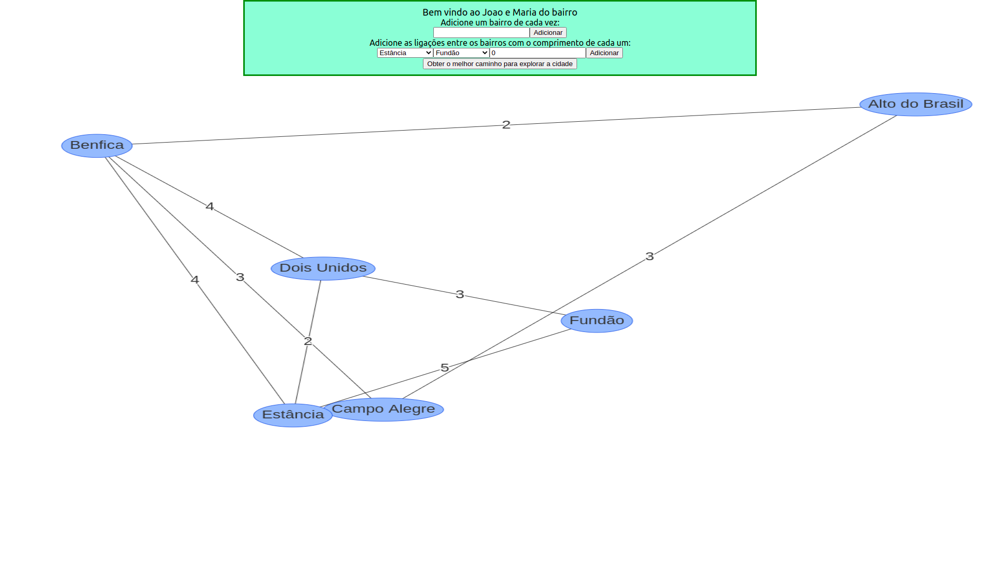
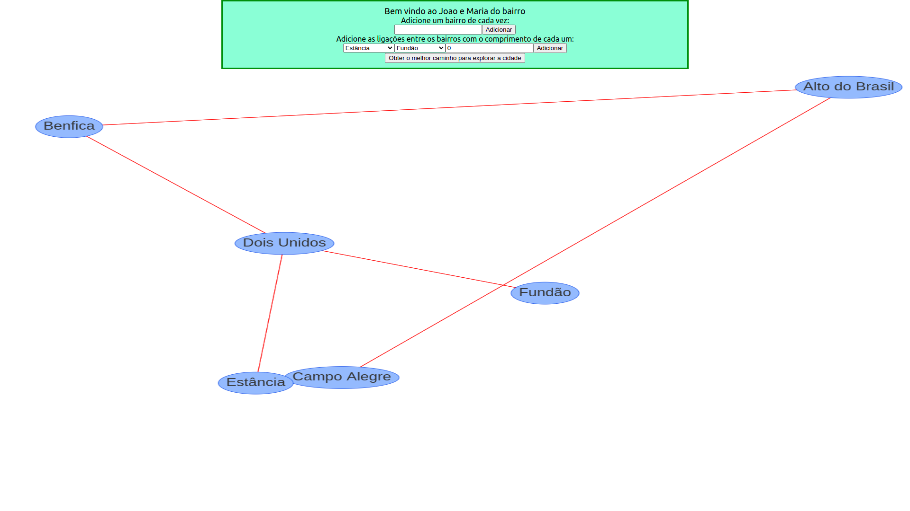
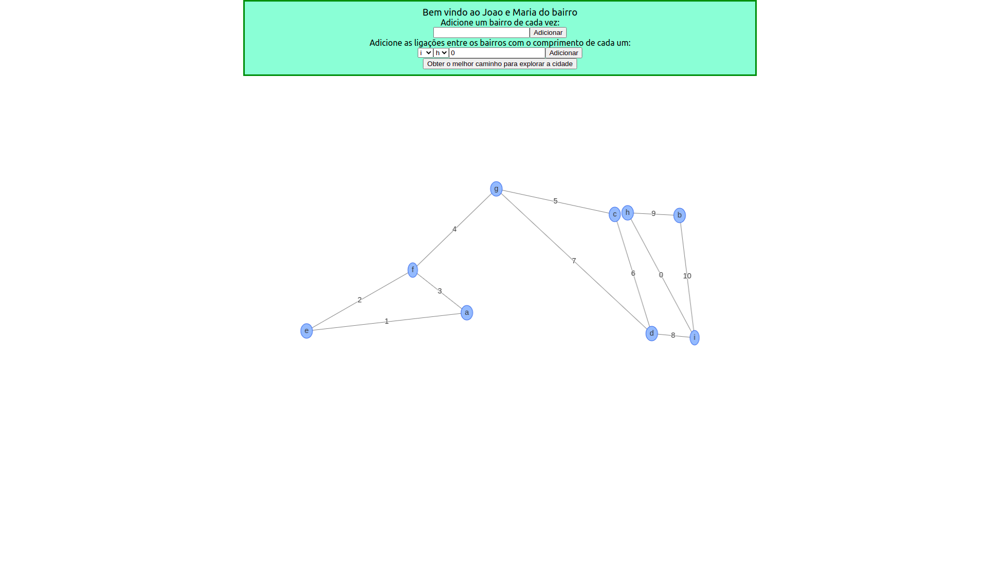

# João e Maria do bairro

**Número da Lista**: 7<br>

**Conteúdo da Disciplina**: Grafos 2<br>

## Alunos
|Matrícula | Aluno |
| -- | -- |
| 18/0030272  | Antonio Ruan Moura Barreto |
| 18/0029177  | Wagner Martins da Cunha |

## Sobre 
Baseado na história de João e Maria que exploravam os lugares colocando pedrinhas por onde andavam, nosso projeto visa, dado uma sequência de bairros e a distância entre eles, oferecer o caminho onde João e Maria gastem o mínimo de pedrinhas possível.

## Screenshots







## Instalação 
**Linguagem**: JavaScript<br>
**Framework**: React<br>

Primeiro faça o download dos arquivos na sua máquina com:

```
$ git clone https://github.com/projeto-de-algoritmos/Grafos2_joao_e_maria_do_bairro.git
```

Após isso vá para a pasta app do projeto com:

```
$ cd Grafos2_joao_e_maria_do_bairro/app/
```

Agora é só instalar as dependências com o seguinte comando:

```
$ npm install
```

## Uso 
Para rodar o projeto, basta após sua instalação realizar este comando:

```
$ npm start
```


